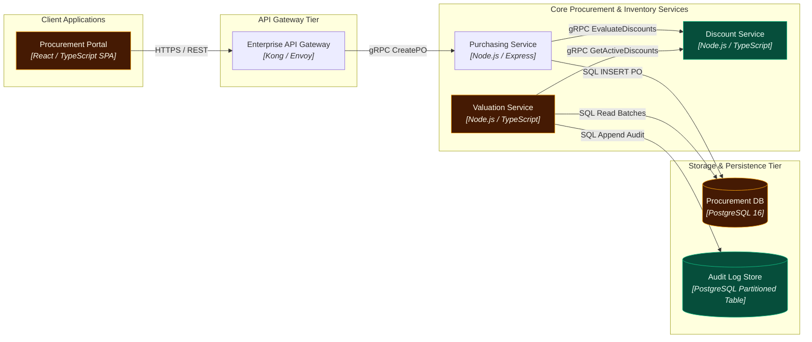
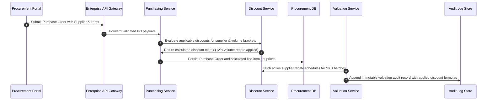

# Supplier Discounts & Volume Rebates in Inventory Valuation

> **Status:** `PROPOSED` | **Date:** 2026-09-17 | **Author:** Staff Systems Architect

## 1. Executive Summary

Integration of dynamic supplier discount rules and tiered rebate calculations into the inventory valuation pipeline with immutable audit trail.

### Assumptions
- Supplier discount tiers are versioned and date-bounded
- Valuation calculations use Weighted Average Cost (WAC) with retrospective rebate adjustments
- Audit logs must meet SOX compliance requirements

## 2. System Boundaries & Components

### Procurement Portal `[VERIFIED]` `[CHANGED]`
- **Type:** `frontend` | **Boundary:** `Client Applications` | **Technology:** `React / TypeScript SPA`
- **Description:** Internal administrative web UI for procurement officers, PO approval, and finance valuation reporting.
- **Repository Files:**
  - `src/admin/procurement/PODetailsPage.tsx`
  - `src/admin/finance/InventoryValuationView.tsx`

### Enterprise API Gateway `[VERIFIED]`
- **Type:** `api_gateway` | **Boundary:** `API Gateway Tier` | **Technology:** `Kong / Envoy`
- **Description:** Terminates mTLS, enforces JWT role-based access control (RBAC), and routes procurement traffic.
- **APIs:**
  - `POST /api/v1/purchase-orders`: Create new purchase order
  - `GET /api/v1/inventory/valuation`: Retrieve real-time inventory valuation

### Purchasing Service `[VERIFIED]`
- **Type:** `service` | **Boundary:** `Core Procurement & Inventory Services` | **Technology:** `Node.js / Express`
- **Description:** Manages purchase order lifecycle, vendor agreements, and goods receipts.
- **Repository Files:**
  - `src/services/purchasing/PurchaseOrderService.ts`

### Discount Service `[INFERRED]` `[ADDED]`
- **Type:** `service` | **Boundary:** `Core Procurement & Inventory Services` | **Technology:** `Node.js / TypeScript`
- **Description:** New service evaluating active contract tiers, tiered volume rebates, and early-payment discounts.
- **Repository Files:**
  - `src/services/discounts/SupplierDiscountEngine.ts`
  - `src/services/discounts/TierEvaluationRule.ts`
- **APIs:**
  - `POST /internal/discounts/evaluate`: Calculates applicable discount matrix for a PO item
- **Failure Modes & Mitigations:**
  - ⚠️ **Conflicting discount rules** (Impact: *Over-discounting or miscalculation*) -> Mitigation: Strict priority ordering and validation guardrails

### Valuation Service `[VERIFIED]` `[CHANGED]`
- **Type:** `service` | **Boundary:** `Core Procurement & Inventory Services` | **Technology:** `Node.js / TypeScript`
- **Description:** Calculates asset valuation using Weighted Average Cost (WAC) adjusted by applicable supplier discounts.
- **Repository Files:**
  - `src/services/inventory/InventoryValuationService.ts`
- **APIs:**
  - `GET /internal/valuation/sku/:skuId`: Get current valuation for SKU

### Procurement DB `[VERIFIED]` `[CHANGED]`
- **Type:** `database` | **Boundary:** `Storage & Persistence Tier` | **Technology:** `PostgreSQL 16`
- **Description:** Primary relational database storing purchase orders, suppliers, discount rules, and inventory batches.

### Audit Log Store `[INFERRED]` `[ADDED]`
- **Type:** `storage` | **Boundary:** `Storage & Persistence Tier` | **Technology:** `PostgreSQL Partitioned Table`
- **Description:** Append-only immutable record of all discount applications and valuation changes for SOX compliance.

## 3. Architecture Decision Records (ADRs)

### ADR-001: Decouple Discount Rule Engine into a Dedicated Subservice
- **Status:** `ACCEPTED`
- **Context:** Discount rules, volume brackets, and contract terms change frequently and independently of inventory batch tracking.
- **Decision:** Extract Supplier Discount calculation logic into a dedicated SupplierDiscountService rather than bloating InventoryValuationService.
- **Consequences:** Clear single responsibility, easier unit testing of complex rebate math, small network hop over internal gRPC.

### ADR-002: Append-Only Immutable Audit Log for Valuation Modifications
- **Status:** `ACCEPTED`
- **Context:** Financial auditors require verifiable proof of how every line item's net cost was computed.
- **Decision:** Write an audit log row containing raw inputs, discount formula used, and resulting net valuation for every valuation event.
- **Consequences:** Increases write volume; mitigated by append-only table partitioning by month.

## 4. Phased Implementation Plan

### Phase 1: Phase 1: Database Migration & Schema Setup
- [ ] **Create supplier_discounts table with date bounds and check constraints** (`low` complexity)
  - Target Component: `primary_db`
  - Files: `src/db/migrations/20260917_create_supplier_discounts.sql`
- [ ] **Create partitioned valuation_audit_logs table with JSONB formula snapshot** (`medium` complexity)
  - Target Component: `audit_store`
  - Files: `src/db/migrations/20260917_create_valuation_audit_logs.sql`

### Phase 2: Phase 2: Supplier Discount Service Implementation
- [ ] **Implement SupplierDiscountEngine evaluating volume brackets and tiered rates** (`high` complexity)
  - Target Component: `supplier_discount_service`
  - Files: `src/services/discounts/SupplierDiscountEngine.ts`
  - Risks: Edge cases where multiple volume thresholds overlap
- [ ] **Add gRPC server endpoints for EvaluateDiscounts interface** (`medium` complexity)
  - Target Component: `supplier_discount_service`
  - Files: `src/services/discounts/DiscountRpcServer.ts`

### Phase 3: Phase 3: Inventory Valuation Integration & Audit Logging
- [ ] **Refactor InventoryValuationService to factor supplier discounts into WAC calculation** (`high` complexity)
  - Target Component: `inventory_valuation_service`
  - Files: `src/services/inventory/InventoryValuationService.ts`
- [ ] **Implement synchronous write to valuation_audit_logs within transaction** (`medium` complexity)
  - Target Component: `inventory_valuation_service`
  - Files: `src/services/inventory/AuditLogger.ts`
- [ ] **Update Procurement Portal to display discount breakdown in PO details** (`medium` complexity)
  - Target Component: `procurement_portal`
  - Files: `src/admin/procurement/PODetailsPage.tsx`

## 5. Diagrams (Mermaid)

### System Flowchart



### Sequence



### Entity Relationships

```mermaid
erDiagram
  suppliers {
    uuid id PK
    varchar(255) name
    varchar(50) annual_tier
    timestamptz created_at
  }
  supplier_discounts {
    uuid id PK
    uuid supplier_id FK
    varchar(50) discount_type
    numeric(12,2) threshold_amount
    numeric(5,2) percentage_rate
    date valid_from
    date valid_to
  }
  purchase_orders {
    uuid id PK
    uuid supplier_id FK
    numeric(12,2) total_gross
    numeric(12,2) total_discount
    numeric(12,2) total_net
    varchar(50) status
  }
  valuation_audit_logs {
    uuid id PK
    uuid batch_id
    uuid sku_id
    numeric(14,4) gross_valuation
    numeric(14,4) discount_applied
    numeric(14,4) net_valuation
    jsonb formula_snapshot
    timestamptz created_at
  }
  suppliers ||--o{ supplier_discounts : "offers"
  suppliers ||--o{ purchase_orders : "fulfills"
```

## 6. Quality Gate

| # | Check | Result | Detail |
| - | ----- | ------ | ------ |
| 1 | Glanceable | ✅ PASS | 7 nodes across 4 boundaries. |
| 2 | Clear boundaries | ✅ PASS | 4 boundaries, all nodes assigned. |
| 3 | Visible dependencies | ✅ PASS | Every non-actor node participates in at least one relationship. |
| 4 | Intelligible arrows | ✅ PASS | Every edge declares a protocol label and a communication mode. |
| 5 | Clean routing | ✅ PASS | 1 of 7 drawn edge(s) graze a non-endpoint card (e_valuation_discount), within tolerance. |
| 6 | Readable labels | ✅ PASS | All labels fit the node card at default zoom. |
| 7 | Deterministic layout | ✅ PASS | Two consecutive layout runs produced identical coordinates. |
| 8 | Balanced density | ✅ PASS | Max 3 nodes per boundary, edge ratio 1.0. |
| 9 | Purposeful animation | ✅ PASS | 7 animated edge(s), each typed by mode and path. |
| 10 | Progressive disclosure | ✅ PASS | Every node has drill-down content in the inspector. |
| 11 | Explicit assumptions | ✅ PASS | 0 assumed, 0 unknown, all justified. |
| 12 | Evidence-backed claims | ✅ PASS | 5 VERIFIED node(s) all cite evidence. |
| 13 | Repository grounding | ➖ SKIP | meta.grounding is "illustrative" — file paths are examples, disk verification skipped. |
| 14 | Implementation traceability | ✅ PASS | All 5 changed component(s) map to implementation tasks. |

Grounding mode: `illustrative` · Nodes: 7 · Edges: 7 · VERIFIED: 5 · INFERRED: 2 · ASSUMED: 0

## 7. Review Summary

### Changed components
- `audit_store` `ADDED` — Audit Log Store
- `inventory_valuation_service` `CHANGED` — Valuation Service
- `primary_db` `CHANGED` — Procurement DB
- `procurement_portal` `CHANGED` — Procurement Portal
- `supplier_discount_service` `ADDED` — Discount Service

### Blast radius
- `audit_store` upstream: `inventory_valuation_service`; downstream: none
- `inventory_valuation_service` upstream: none; downstream: `audit_store`, `primary_db`, `supplier_discount_service`
- `primary_db` upstream: `api_gateway`, `inventory_valuation_service`, `procurement_portal`, `purchasing_service`; downstream: none
- `procurement_portal` upstream: none; downstream: `api_gateway`, `primary_db`, `purchasing_service`, `supplier_discount_service`
- `supplier_discount_service` upstream: `api_gateway`, `inventory_valuation_service`, `procurement_portal`, `purchasing_service`; downstream: none

### Assumptions
- Supplier discount tiers are versioned and date-bounded
- Valuation calculations use Weighted Average Cost (WAC) with retrospective rebate adjustments
- Audit logs must meet SOX compliance requirements

### Evidence manifest
- `ev_procurement_portal` file `[compatibility]`
- `ev_api_gateway` api `[compatibility]`
- `ev_purchasing_service` file `[compatibility]`
- `ev_inventory_valuation_service` file `[compatibility]`
- `ev_primary_db` table `[compatibility]`
- `ev_legacy_files_file_procurement_portal_src_admin_procurement_podetailspage_tsx` file src/admin/procurement/PODetailsPage.tsx `[compatibility]`
- `ev_legacy_files_file_procurement_portal_src_admin_finance_inventoryvaluationview_tsx` file src/admin/finance/InventoryValuationView.tsx `[compatibility]`
- `ev_legacy_apis_api_api_gateway_api_v1_purchase_orders` api /api/v1/purchase-orders `[compatibility]`
- `ev_legacy_apis_api_api_gateway_api_v1_inventory_valuation` api /api/v1/inventory/valuation `[compatibility]`
- `ev_legacy_files_file_purchasing_service_src_services_purchasing_purchaseorderservice_ts` file src/services/purchasing/PurchaseOrderService.ts `[compatibility]`
- `ev_legacy_tables_table_purchasing_service_purchase_orders` table purchase_orders `[compatibility]`
- `ev_legacy_tables_table_purchasing_service_po_items` table po_items `[compatibility]`
- `ev_legacy_tables_table_purchasing_service_suppliers` table suppliers `[compatibility]`
- `ev_legacy_files_file_supplier_discount_service_src_services_discounts_supplierdiscountengine_ts` file src/services/discounts/SupplierDiscountEngine.ts `[compatibility]`
- `ev_legacy_files_file_supplier_discount_service_src_services_discounts_tierevaluationrule_ts` file src/services/discounts/TierEvaluationRule.ts `[compatibility]`
- `ev_legacy_apis_api_supplier_discount_service_internal_discounts_evaluate` api /internal/discounts/evaluate `[compatibility]`
- `ev_legacy_tables_table_supplier_discount_service_supplier_discounts` table supplier_discounts `[compatibility]`
- `ev_legacy_tables_table_supplier_discount_service_discount_tiers` table discount_tiers `[compatibility]`
- `ev_legacy_files_file_inventory_valuation_service_src_services_inventory_inventoryvaluationservice_ts` file src/services/inventory/InventoryValuationService.ts `[compatibility]`
- `ev_legacy_apis_api_inventory_valuation_service_internal_valuation_sku_skuid` api /internal/valuation/sku/:skuId `[compatibility]`
- `ev_legacy_tables_table_inventory_valuation_service_inventory_batches` table inventory_batches `[compatibility]`
- `ev_legacy_tables_table_inventory_valuation_service_valuation_audit_logs` table valuation_audit_logs `[compatibility]`

### Implementation traceability
- Mapped: `audit_store`, `inventory_valuation_service`, `primary_db`, `procurement_portal`, `supplier_discount_service`
- Gaps: none
