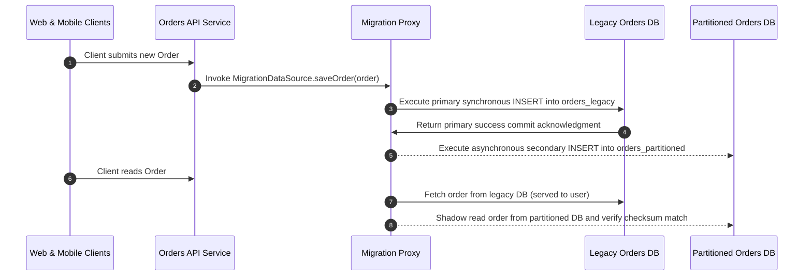

# Zero-Downtime Partitioning & Migration of Monolithic Orders DB

> **Status:** `PROPOSED` | **Date:** 2026-09-17 | **Author:** Principal Database Reliability Architect

## 1. Executive Summary

Phased zero-downtime database migration from a monolithic 120M-row orders table to declarative monthly range-partitioned tables using dual-writes, Debezium CDC backfill, and shadow read verification.

### Assumptions
- Peak write throughput is ~1,500 transactions per second (TPS)
- Target PostgreSQL 16 supports declarative range partitioning with runtime partition pruning
- Network latency between proxy, legacy DB, and new DB cluster is under 1.5ms

## 2. System Boundaries & Components

### Web & Mobile Clients `[INFERRED]`
- **Type:** `actor` | **Boundary:** `Client Traffic & Gateway` | **Technology:** `Web SPA & Mobile Apps`
- **Description:** Incoming customer order placements, tracking inquiries, and checkout traffic.

### Orders API Service `[VERIFIED]` `[CHANGED]`
- **Type:** `service` | **Boundary:** `Application & Migration Proxy Layer` | **Technology:** `Node.js / TypeScript`
- **Description:** Domain service handling order operations; modified to use the Migration Data Access Layer.
- **Repository Files:**
  - `src/services/orders/OrderService.ts`
  - `src/services/orders/OrderRepository.ts`

### Migration Proxy `[INFERRED]` `[ADDED]`
- **Type:** `service` | **Boundary:** `Application & Migration Proxy Layer` | **Technology:** `TypeScript / pg-pool`
- **Description:** Dynamic routing layer controlling dual-writes, shadow reads, and feature flag cutover.
- **Repository Files:**
  - `src/db/migration-proxy/MigrationDataSource.ts`
  - `src/db/migration-proxy/ShadowReadComparator.ts`
- **Failure Modes & Mitigations:**
  - ⚠️ **Target DB write failure** (Impact: *Secondary write lost*) -> Mitigation: DLQ buffer and idempotent replay

### Debezium CDC Connector `[INFERRED]` `[ADDED]`
- **Type:** `worker` | **Boundary:** `CDC Replication & Backfill Pipeline` | **Technology:** `Debezium / Kafka Connect`
- **Description:** Streams PostgreSQL Write-Ahead Log (WAL) logical replication records into Kafka.

### Kafka Backfill Topic `[INFERRED]` `[ADDED]`
- **Type:** `topic` | **Boundary:** `CDC Replication & Backfill Pipeline` | **Technology:** `Apache Kafka 3.6`
- **Description:** High-throughput log buffer decoupling CDC extraction from target DB ingestion.

### Backfill Consumer `[INFERRED]` `[ADDED]`
- **Type:** `worker` | **Boundary:** `CDC Replication & Backfill Pipeline` | **Technology:** `Go / Sarama`
- **Description:** Batches Kafka events and bulk inserts into appropriate monthly range partitions.

### Legacy Orders DB `[VERIFIED]` `[REMOVED]`
- **Type:** `database` | **Boundary:** `Database Storage Engines` | **Technology:** `PostgreSQL 14 (Monolithic)`
- **Description:** Current monolithic unpartitioned table with 120M rows, suffering high autovacuum bloat.

### Partitioned Orders DB `[INFERRED]` `[ADDED]`
- **Type:** `database` | **Boundary:** `Database Storage Engines` | **Technology:** `PostgreSQL 16 (partitioned)`
- **Description:** New database partitioned by created_at timestamp into monthly partitions with BRIN indexing.

## 3. Architecture Decision Records (ADRs)

### ADR-101: Use Application-Level Dual Writing via Migration Proxy Layer
- **Status:** `ACCEPTED`
- **Context:** Need immediate write consistency on newly created orders without relying solely on CDC replication lag.
- **Decision:** Implement dual-write routing in a lightweight Migration Proxy Layer: Primary write to Legacy DB (synchronous), asynchronous secondary write to Partitioned DB with fallback buffer.
- **Consequences:** Slight increase in API write latency (~3-5ms); absolute guarantee of real-time dual writes during migration window.

### ADR-102: Debezium CDC for Historical Backfill and In-Flight Catchup
- **Status:** `ACCEPTED`
- **Context:** Backfilling 120M rows via batch SQL queries degrades primary DB IOPS and causes lock contention.
- **Decision:** Use Debezium reading PostgreSQL WAL logs published to Kafka, throttled to 2,500 rows/sec during off-peak hours.
- **Consequences:** Zero table locking on active rows; requires Kafka cluster resources.

### ADR-103: Shadow Read Verification Gate at 100% Volume for 7 Days
- **Status:** `ACCEPTED`
- **Context:** Cutover cannot occur until we have absolute mathematical certainty of zero row discrepancy between legacy and new partitions.
- **Decision:** Route 100% of read queries to both stores in shadow mode; compare responses asynchronously; gate cutover on zero checksum discrepancies for 7 consecutive days.
- **Consequences:** Doubled read IOPS during verification phase; complete risk elimination.

## 4. Phased Implementation Plan

### Phase 1: Phase 1: Target Schema Provisioning & Partitions
- [ ] **Deploy PostgreSQL 16 partitioned orders schema with monthly range partition rules** (`medium` complexity)
  - Target Component: `partitioned_orders_db`
  - Files: `src/db/migrations/20260917_create_partitioned_orders.sql`
- [ ] **Configure BRIN index on created_at and B-Tree index on (customer_id, created_at)** (`low` complexity)
  - Target Component: `partitioned_orders_db`
  - Files: `src/db/migrations/20260917_create_partition_indexes.sql`

### Phase 2: Phase 2: Migration Proxy & Application Dual Writing
- [ ] **Implement MigrationDataSource in OrderRepository with async dual-write dispatch** (`high` complexity)
  - Target Component: `migration_proxy`
  - Files: `src/db/migration-proxy/MigrationDataSource.ts`
- [ ] **Deploy dual-write feature flag to production with 10% canary ramp-up to 100%** (`medium` complexity)
  - Target Component: `orders_api_service`
  - Files: `src/config/FeatureFlags.ts`
- [ ] **Provision backfill topic with 24h retention** (`low` complexity)
  - Target Component: `kafka_buffer`
  - Files: `infra/kafka/topics/orders-backfill.yaml`
  - Risks: Under-provisioned partitions throttle the backfill

### Phase 3: Phase 3: CDC Pipeline & Historical Backfill Execution
- [ ] **Deploy Debezium Kafka connector with pgoutput logical replication plugin** (`medium` complexity)
  - Target Component: `cdc_debezium_worker`
  - Files: `infra/debezium/orders-connector.json`
- [ ] **Run backfill consumer to populate 120M historical rows with conflict resolution** (`high` complexity)
  - Target Component: `backfill_consumer`
  - Files: `src/workers/backfill/ConsumerWorker.ts`
  - Risks: Replication lag exceeding WAL disk capacity; throttle to 2,500 rows/sec

### Phase 4: Phase 4: Shadow Read Verification & Discrepancy Gating
- [ ] **Enable shadow reading and real-time checksum comparison in Migration Proxy** (`medium` complexity)
  - Target Component: `migration_proxy`
  - Files: `src/db/migration-proxy/ShadowReadComparator.ts`
- [ ] **Run 7-day observation gate requiring 0.000% data mismatch across 50M shadow reads** (`low` complexity)
  - Target Component: `migration_proxy`
  - Files: `scripts/verify-migration-checksums.py`

### Phase 5: Phase 5: Cutover to Partitioned Primary & Legacy Decommissioning
- [ ] **Flip primary read and write traffic to Target Partitioned DB cluster** (`high` complexity)
  - Target Component: `migration_proxy`
  - Files: `src/config/FeatureFlags.ts`
- [ ] **Decommission Debezium connector, remove dual-write proxy code, drop legacy table** (`low` complexity)
  - Target Component: `legacy_orders_db`
  - Files: `src/db/migration-proxy/cleanup.ts`

## 5. Diagrams (Mermaid)

### System Flowchart

```mermaid
flowchart LR
  subgraph b_client["Client Traffic & Gateway"]
    client_traffic(["Web & Mobile Clients [INFERRED]"])
  end
  subgraph b_migration_core["Application & Migration Proxy Layer"]
    orders_api_service["Orders API Service<br/><i>[Node.js / TypeScript]</i>"]
    migration_proxy["Migration Proxy<br/><i>[TypeScript / pg-pool]</i>"]
  end
  subgraph b_cdc_pipeline["CDC Replication & Backfill Pipeline"]
    cdc_debezium_worker["Debezium CDC Connector<br/><i>[Debezium / Kafka Connect]</i>"]
    kafka_buffer>"Kafka Backfill Topic<br/><i>[Apache Kafka 3.6]</i>"]
    backfill_consumer["Backfill Consumer<br/><i>[Go / Sarama]</i>"]
  end
  subgraph b_storage_tier["Database Storage Engines"]
    legacy_orders_db[("Legacy Orders DB<br/><i>[PostgreSQL 14 (Monolithic)]</i>")]
    partitioned_orders_db[("Partitioned Orders DB<br/><i>[PostgreSQL 16 (partitioned)]</i>")]
  end
  client_traffic -->|"HTTPS REST / Orders"| orders_api_service
  orders_api_service -->|"DAO Call"| migration_proxy
  migration_proxy -->|"Primary Sync Write"| legacy_orders_db
  migration_proxy -.->|"Dual Async Write"| partitioned_orders_db
  legacy_orders_db -.->|"WAL Replication Slot"| cdc_debezium_worker
  cdc_debezium_worker -.->|"Produce CDC Events"| kafka_buffer
  kafka_buffer -.->|"Consume Batches"| backfill_consumer
  backfill_consumer -.->|"Bulk Upsert Partition"| partitioned_orders_db
  classDef added fill:#064e3b,stroke:#10b981,color:#ecfdf5;
  class migration_proxy,cdc_debezium_worker,kafka_buffer,backfill_consumer,partitioned_orders_db added;
  classDef changed fill:#451a03,stroke:#f59e0b,color:#fffbeb;
  class orders_api_service changed;
  classDef removed fill:#4c0519,stroke:#f43f5e,color:#fff1f2,stroke-dasharray: 4 3;
  class legacy_orders_db removed;
```



### Sequence



### Entity Relationships

```mermaid
erDiagram
  orders_legacy {
    bigint id PK
    uuid customer_id
    numeric(10,2) total_amount
    timestamptz created_at
  }
  orders_partitioned {
    bigint id PK
    timestamptz created_at PK
    uuid customer_id
    numeric(10,2) total_amount
    varchar(32) status
  }
  orders_2026_09 {
    ['2026-09-01'_TO_'2026-10-01') RANGE
  }
  orders_2026_10 {
    ['2026-10-01'_TO_'2026-11-01') RANGE
  }
  orders_partitioned ||--|| orders_2026_09 : "partition_for"
  orders_partitioned ||--|| orders_2026_10 : "partition_for"
```

## 6. Quality Gate

| # | Check | Result | Detail |
| - | ----- | ------ | ------ |
| 1 | Glanceable | ✅ PASS | 8 nodes across 4 boundaries. |
| 2 | Clear boundaries | ✅ PASS | 4 boundaries, all nodes assigned. |
| 3 | Visible dependencies | ✅ PASS | Every non-actor node participates in at least one relationship. |
| 4 | Intelligible arrows | ✅ PASS | Every edge declares a protocol label and a communication mode. |
| 5 | Clean routing | ✅ PASS | 1 of 8 drawn edge(s) graze a non-endpoint card (e_proxy_target), within tolerance. |
| 6 | Readable labels | ✅ PASS | All labels fit the node card at default zoom. |
| 7 | Deterministic layout | ✅ PASS | Two consecutive layout runs produced identical coordinates. |
| 8 | Balanced density | ✅ PASS | Max 3 nodes per boundary, edge ratio 1.0. |
| 9 | Purposeful animation | ✅ PASS | 8 animated edge(s), each typed by mode and path. |
| 10 | Progressive disclosure | ✅ PASS | Every node has drill-down content in the inspector. |
| 11 | Explicit assumptions | ✅ PASS | 0 assumed, 0 unknown, all justified. |
| 12 | Evidence-backed claims | ✅ PASS | 2 VERIFIED node(s) all cite evidence. |
| 13 | Repository grounding | ➖ SKIP | meta.grounding is "illustrative" — file paths are examples, disk verification skipped. |
| 14 | Implementation traceability | ✅ PASS | All 7 changed component(s) map to implementation tasks. |

Grounding mode: `illustrative` · Nodes: 8 · Edges: 8 · VERIFIED: 2 · INFERRED: 6 · ASSUMED: 0

## 7. Review Summary

### Changed components
- `backfill_consumer` `ADDED` — Backfill Consumer
- `cdc_debezium_worker` `ADDED` — Debezium CDC Connector
- `kafka_buffer` `ADDED` — Kafka Backfill Topic
- `legacy_orders_db` `REMOVED` — Legacy Orders DB
- `migration_proxy` `ADDED` — Migration Proxy
- `orders_api_service` `CHANGED` — Orders API Service
- `partitioned_orders_db` `ADDED` — Partitioned Orders DB

### Blast radius
- `backfill_consumer` upstream: `cdc_debezium_worker`, `client_traffic`, `kafka_buffer`, `legacy_orders_db`, `migration_proxy`, `orders_api_service`; downstream: `partitioned_orders_db`
- `cdc_debezium_worker` upstream: `client_traffic`, `legacy_orders_db`, `migration_proxy`, `orders_api_service`; downstream: `backfill_consumer`, `kafka_buffer`, `partitioned_orders_db`
- `kafka_buffer` upstream: `cdc_debezium_worker`, `client_traffic`, `legacy_orders_db`, `migration_proxy`, `orders_api_service`; downstream: `backfill_consumer`, `partitioned_orders_db`
- `legacy_orders_db` upstream: `client_traffic`, `migration_proxy`, `orders_api_service`; downstream: `backfill_consumer`, `cdc_debezium_worker`, `kafka_buffer`, `partitioned_orders_db`
- `migration_proxy` upstream: `client_traffic`, `orders_api_service`; downstream: `backfill_consumer`, `cdc_debezium_worker`, `kafka_buffer`, `legacy_orders_db`, `partitioned_orders_db`
- `orders_api_service` upstream: `client_traffic`; downstream: `backfill_consumer`, `cdc_debezium_worker`, `kafka_buffer`, `legacy_orders_db`, `migration_proxy`, `partitioned_orders_db`
- `partitioned_orders_db` upstream: `backfill_consumer`, `cdc_debezium_worker`, `client_traffic`, `kafka_buffer`, `legacy_orders_db`, `migration_proxy`, `orders_api_service`; downstream: none

### Assumptions
- Peak write throughput is ~1,500 transactions per second (TPS)
- Target PostgreSQL 16 supports declarative range partitioning with runtime partition pruning
- Network latency between proxy, legacy DB, and new DB cluster is under 1.5ms

### Evidence manifest
- `ev_orders_api_service` file `[compatibility]`
- `ev_legacy_orders_db` table `[compatibility]`
- `ev_legacy_files_file_orders_api_service_src_services_orders_orderservice_ts` file src/services/orders/OrderService.ts `[compatibility]`
- `ev_legacy_files_file_orders_api_service_src_services_orders_orderrepository_ts` file src/services/orders/OrderRepository.ts `[compatibility]`
- `ev_legacy_files_file_migration_proxy_src_db_migration_proxy_migrationdatasource_ts` file src/db/migration-proxy/MigrationDataSource.ts `[compatibility]`
- `ev_legacy_files_file_migration_proxy_src_db_migration_proxy_shadowreadcomparator_ts` file src/db/migration-proxy/ShadowReadComparator.ts `[compatibility]`
- `ev_legacy_tables_table_legacy_orders_db_orders_legacy` table orders_legacy `[compatibility]`
- `ev_legacy_tables_table_partitioned_orders_db_orders_partitioned` table orders_partitioned `[compatibility]`
- `ev_legacy_tables_table_partitioned_orders_db_orders_2026_08` table orders_2026_08 `[compatibility]`
- `ev_legacy_tables_table_partitioned_orders_db_orders_2026_09` table orders_2026_09 `[compatibility]`
- `ev_legacy_tables_table_partitioned_orders_db_orders_2026_10` table orders_2026_10 `[compatibility]`

### Implementation traceability
- Mapped: `backfill_consumer`, `cdc_debezium_worker`, `kafka_buffer`, `legacy_orders_db`, `migration_proxy`, `orders_api_service`, `partitioned_orders_db`
- Gaps: none
