# Distributed Order Fulfillment Saga with Outbox & DLQ

> **Status:** `ACCEPTED` | **Date:** 2026-09-17 | **Author:** Principal Distributed Systems Architect

## 1. Executive Summary

Event-driven microservice orchestration for order checkout, payment capture, inventory allocation, and automated compensating rollbacks via Kafka and Dead Letter Queues.

### Assumptions
- Kafka topic partition count is aligned with SKU/Order ID hash keys for strict FIFO per order
- All service event handlers are idempotent using unique event UUID deduplication
- Maximum allowed saga execution time is 45 seconds before triggering auto-compensation

## 2. System Boundaries & Components

### Checkout Mobile App `[VERIFIED]`
- **Type:** `mobile` | **Boundary:** `Client Layer` | **Technology:** `React Native (iOS/Android)`
- **Description:** User shopping app initiating order placement and receiving real-time WebSocket status updates.
- **Repository Files:**
  - `src/screens/CheckoutScreen.tsx`
- **APIs:**
  - `POST /api/v1/orders`: Submit a checkout basket

### Saga Orchestrator `[VERIFIED]` `[CHANGED]`
- **Type:** `service` | **Boundary:** `Order Management & Outbox Tier` | **Technology:** `Node.js / Temporal`
- **Description:** Central state machine coordinator managing saga progression, timers, and compensating transactions.
- **Repository Files:**
  - `src/saga/OrderFulfillmentSaga.ts`
  - `src/saga/SagaStateMachine.ts`
- **APIs:**
  - `POST /api/v1/orders/checkout`: Initiates order checkout saga
- **Failure Modes & Mitigations:**
  - ⚠️ **Orchestrator node restart mid-saga** (Impact: *In-flight saga orphaned*) -> Mitigation: Persist state in saga_instances; resume from WAL checkpoint on startup

### Outbox Table `[VERIFIED]` `[ADDED]`
- **Type:** `storage` | **Boundary:** `Order Management & Outbox Tier` | **Technology:** `PostgreSQL 16`
- **Description:** Transactional outbox table written atomically in the same transaction as order record creation.

### Outbox Relay Worker `[INFERRED]` `[ADDED]`
- **Type:** `worker` | **Boundary:** `Order Management & Outbox Tier` | **Technology:** `Go Daemon / Debezium`
- **Description:** Relays pending outbox records into Kafka with at-least-once delivery guarantees.

### Apache Kafka Event Bus `[VERIFIED]`
- **Type:** `topic` | **Boundary:** `Event Streaming Infrastructure` | **Technology:** `Apache Kafka 3.6 / Strimzi`
- **Description:** Distributed message broker routing domain events: order.events, payment.events, inventory.events, warehouse.events.
- **Repository Files:**
  - `infra/kafka/topics/order-events.yaml`

### Payment Service `[VERIFIED]`
- **Type:** `service` | **Boundary:** `Fulfillment Subsystems & Microservices` | **Technology:** `Java / Spring Boot`
- **Description:** Interacts with payment gateways (Stripe / Adyen) for authorization, capture, and compensation refunds.
- **Repository Files:**
  - `services/payment/src/PaymentController.java`
- **APIs:**
  - `POST /payments/refund`: Compensating refund for a failed saga
- **Failure Modes & Mitigations:**
  - ⚠️ **Payment gateway timeout** (Impact: *Transaction undetermined*) -> Mitigation: Idempotent payment query before compensation

### Inventory Service `[VERIFIED]` `[CHANGED]`
- **Type:** `service` | **Boundary:** `Fulfillment Subsystems & Microservices` | **Technology:** `Node.js / Fastify`
- **Description:** Performs atomic stock reservation in Redis/Postgres and releases reservations during compensation.

### Warehouse Service `[VERIFIED]`
- **Type:** `service` | **Boundary:** `Fulfillment Subsystems & Microservices` | **Technology:** `Python / FastAPI`
- **Description:** Communicates with Automated Storage & Retrieval Systems (ASRS) and 3PL courier APIs.
- **Repository Files:**
  - `services/warehouse/app/dispatch.py`
- **APIs:**
  - `POST /dispatch`: Create a warehouse dispatch order

### Fulfillment DLQ `[INFERRED]` `[ADDED]`
- **Type:** `queue` | **Boundary:** `Reliability & Failure Recovery Tier` | **Technology:** `Kafka DLQ topic`
- **Description:** Isolates unprocessable or repeatedly failed messages after 3 failed retries.

### DLQ Triage Worker `[INFERRED]` `[ADDED]`
- **Type:** `worker` | **Boundary:** `Reliability & Failure Recovery Tier` | **Technology:** `TypeScript / PagerDuty SDK`
- **Description:** Listens to DLQ topic, writes failed event record to DB, and pages on-call engineering team.

## 3. Architecture Decision Records (ADRs)

### ADR-201: Transactional Outbox Pattern for Atomic Persistence and Message Publishing
- **Status:** `ACCEPTED`
- **Context:** Writing to orders DB and publishing to Kafka in a single HTTP request causes dual-write inconsistencies if Kafka is unreachable.
- **Decision:** Persist domain events into an order_outbox table within the same ACID database transaction; an asynchronous poller worker publishes events to Kafka.
- **Consequences:** Guarantees at-least-once delivery; consumers must be idempotent.

### ADR-202: Orchestrated Saga Pattern over Pure Choreography
- **Status:** `ACCEPTED`
- **Context:** Choreographed sagas with 5+ services lead to cyclic event dependencies and difficult rollback visibility.
- **Decision:** Use OrderSagaOrchestrator to explicitly manage state machine steps, track timeouts, and dispatch compensating commands.
- **Consequences:** Centralized failure visibility; orchestrator requires high availability and state persistence.

### ADR-203: Exponential Backoff with Dead Letter Queue (DLQ) Quarantine
- **Status:** `ACCEPTED`
- **Context:** Poison pill messages must not block consumer partitions indefinitely.
- **Decision:** Retry failed event processing 3 times with exponential backoff; route permanently failing messages to fulfillment.dlq and trigger PagerDuty alert.
- **Consequences:** Prevents partition stalls; requires engineering runbook for manual DLQ inspection and replay.

## 4. Phased Implementation Plan

### Phase 1: Phase 1: Transactional Outbox Schema & Publisher Daemon
- [ ] **Create order_outbox table with status index and JSONB payload column** (`low` complexity)
  - Target Component: `outbox_table`
  - Files: `src/db/migrations/20260917_create_order_outbox.sql`
- [ ] **Deploy Outbox Relay Worker daemon with batch polling and Kafka producer confirmation** (`high` complexity)
  - Target Component: `outbox_poller`
  - Files: `src/workers/outbox-relay/OutboxRelayWorker.ts`
  - Risks: Outbox table query contention under high insert rate; index on status and created_at

### Phase 2: Phase 2: Saga State Machine & Orchestration Logic
- [ ] **Define SagaStateMachine transitions with timeout guards** (`high` complexity)
  - Target Component: `saga_orchestrator`
  - Files: `src/saga/SagaStateMachine.ts`
- [ ] **Implement automated compensating rollback handlers for Payment and Inventory** (`high` complexity)
  - Target Component: `saga_orchestrator`
  - Files: `src/saga/compensations/CompensatingRollbackHandler.ts`
- [ ] **Add idempotent ReleaseInventory compensation handler** (`medium` complexity)
  - Target Component: `inventory_service`
  - Files: `services/inventory/src/InventoryCompensationHandler.ts`
  - Risks: Double release if the handler is not keyed by saga id

### Phase 3: Phase 3: Dead Letter Queue (DLQ) & PagerDuty Alerting Pipeline
- [ ] **Configure Kafka dead-letter topic 'fulfillment.dlq' with 30-day retention** (`low` complexity)
  - Target Component: `dlq_queue`
  - Files: `infra/kafka/topics/fulfillment-dlq.yaml`
- [ ] **Build DLQ Triage Worker to persist failure context and fire PagerDuty API triggers** (`medium` complexity)
  - Target Component: `dlq_triage_worker`
  - Files: `src/workers/dlq/DlqTriageWorker.ts`

## 5. Diagrams (Mermaid)

### System Flowchart

```mermaid
flowchart LR
  subgraph b_client["Client Layer"]
    checkout_app["Checkout Mobile App<br/><i>[React Native (iOS/Android)]</i>"]
  end
  subgraph b_orchestrator["Order Management & Outbox Tier"]
    saga_orchestrator["Saga Orchestrator<br/><i>[Node.js / Temporal]</i>"]
    outbox_table[("Outbox Table<br/><i>[PostgreSQL 16]</i>")]
    outbox_poller["Outbox Relay Worker<br/><i>[Go Daemon / Debezium]</i>"]
  end
  subgraph b_event_bus["Event Streaming Infrastructure"]
    kafka_broker>"Apache Kafka Event Bus<br/><i>[Apache Kafka 3.6 / Strimzi]</i>"]
  end
  subgraph b_subsystems["Fulfillment Subsystems & Microservices"]
    payment_service["Payment Service<br/><i>[Java / Spring Boot]</i>"]
    inventory_service["Inventory Service<br/><i>[Node.js / Fastify]</i>"]
    warehouse_service["Warehouse Service<br/><i>[Python / FastAPI]</i>"]
  end
  subgraph b_dead_letter["Reliability & Failure Recovery Tier"]
    dlq_queue>"Fulfillment DLQ<br/><i>[Kafka DLQ topic]</i>"]
    dlq_triage_worker["DLQ Triage Worker<br/><i>[TypeScript / PagerDuty SDK]</i>"]
  end
  checkout_app -->|"HTTPS POST /checkout"| saga_orchestrator
  saga_orchestrator -->|"Atomic SQL INSERT"| outbox_table
  outbox_table -->|"Poll Pending Events"| outbox_poller
  outbox_poller -.->|"Produce OrderCreatedEvent"| kafka_broker
  kafka_broker -.->|"Consume OrderCreated"| payment_service
  payment_service -.->|"Produce PaymentAuthorized"| kafka_broker
  kafka_broker -.->|"Consume PaymentAuthorized"| inventory_service
  inventory_service -.->|"Produce InventoryReserved"| kafka_broker
  kafka_broker -.->|"Consume InventoryReserved"| warehouse_service
  warehouse_service -.->|"Route 3x Failed Message"| dlq_queue
  dlq_queue -.->|"Consume Poison Message"| dlq_triage_worker
  kafka_broker -.->|"Failure event"| saga_orchestrator
  saga_orchestrator -->|"Compensate: refund"| payment_service
  saga_orchestrator -->|"Compensate: release"| inventory_service
  classDef added fill:#064e3b,stroke:#10b981,color:#ecfdf5;
  class outbox_table,outbox_poller,dlq_queue,dlq_triage_worker added;
  classDef changed fill:#451a03,stroke:#f59e0b,color:#fffbeb;
  class saga_orchestrator,inventory_service changed;
```



### Sequence

```mermaid
sequenceDiagram
  autonumber
  participant checkout_app as Checkout Mobile App
  participant saga_orchestrator as Saga Orchestrator
  participant outbox_table as Outbox Table
  participant outbox_poller as Outbox Relay Worker
  participant kafka_broker as Apache Kafka Event Bus
  participant payment_service as Payment Service
  participant inventory_service as Inventory Service
  participant warehouse_service as Warehouse Service
  participant dlq_queue as Fulfillment DLQ
  participant dlq_triage_worker as DLQ Triage Worker
  checkout_app->>saga_orchestrator: Customer submits Checkout for Order #9901
  saga_orchestrator->>outbox_table: Atomically commit Order (STATUS=PENDING) and Outbox event in single DB TX
  outbox_poller-->>kafka_broker: Publish OrderCreatedEvent to Kafka topic 'order.events'
  kafka_broker-->>payment_service: Payment Service captures payment from Stripe token ($149.00)
  payment_service-->>kafka_broker: Emit PaymentCapturedEvent to 'payment.events'
  kafka_broker-->>inventory_service: Inventory Service allocates SKU stock (Quantity: 2)
  inventory_service-->>kafka_broker: Emit InventoryReservedEvent to 'inventory.events'
  kafka_broker-->>warehouse_service: Warehouse Service attempts dispatch but encounters damaged physical stock
  warehouse_service-->>kafka_broker: Emit WarehouseDispatchFailedEvent to trigger saga compensation
  kafka_broker-->>saga_orchestrator: Orchestrator receives failure event; executes CompensateOrderSaga()
  saga_orchestrator->>payment_service: COMPENSATION: Invoke RefundPayment(order_id) to refund $149.00
  saga_orchestrator->>inventory_service: COMPENSATION: Invoke ReleaseInventory(order_id) to unlock reserved units
  warehouse_service-->>dlq_queue: Route corrupted payload to fulfillment.dlq after 3 retries
  dlq_queue-->>dlq_triage_worker: Trigger PagerDuty High-Severity Alert for on-call triage
```

### Entity Relationships

```mermaid
erDiagram
  orders {
    uuid id PK
    uuid customer_id
    numeric(10,2) total_amount
    varchar(32) status
    timestamptz created_at
  }
  order_outbox {
    uuid id PK
    uuid aggregate_id
    varchar(100) event_type
    jsonb payload
    varchar(20) status
    timestamptz created_at
  }
  saga_instances {
    uuid saga_id PK
    uuid order_id FK
    varchar(50) current_state
    varchar(50) compensation_status
    timestamptz updated_at
  }
  dead_letter_records {
    uuid id PK
    varchar(100) topic
    jsonb original_payload
    text error_stack
    int retry_count
    timestamptz quarantined_at
  }
  orders ||--|| saga_instances : "tracked_by"
  orders ||--o{ order_outbox : "generates"
```

## 6. Quality Gate

| # | Check | Result | Detail |
| - | ----- | ------ | ------ |
| 1 | Glanceable | ✅ PASS | 10 nodes across 5 boundaries. |
| 2 | Clear boundaries | ✅ PASS | 5 boundaries, all nodes assigned. |
| 3 | Visible dependencies | ✅ PASS | Every non-actor node participates in at least one relationship. |
| 4 | Intelligible arrows | ✅ PASS | Every edge declares a protocol label and a communication mode. |
| 5 | Clean routing | ✅ PASS | 2 of 14 drawn edge(s) graze a non-endpoint card (e_outbox_poller, e14), within tolerance. |
| 6 | Readable labels | ✅ PASS | All labels fit the node card at default zoom. |
| 7 | Deterministic layout | ✅ PASS | Two consecutive layout runs produced identical coordinates. |
| 8 | Balanced density | ✅ PASS | Max 3 nodes per boundary, edge ratio 1.4. |
| 9 | Purposeful animation | ✅ PASS | 14 animated edge(s), each typed by mode and path. |
| 10 | Progressive disclosure | ✅ PASS | Every node has drill-down content in the inspector. |
| 11 | Explicit assumptions | ✅ PASS | 0 assumed, 0 unknown, all justified. |
| 12 | Evidence-backed claims | ✅ PASS | 7 VERIFIED node(s) all cite evidence. |
| 13 | Repository grounding | ➖ SKIP | meta.grounding is "illustrative" — file paths are examples, disk verification skipped. |
| 14 | Implementation traceability | ✅ PASS | All 6 changed component(s) map to implementation tasks. |

Grounding mode: `illustrative` · Nodes: 10 · Edges: 14 · VERIFIED: 7 · INFERRED: 3 · ASSUMED: 0

## 7. Review Summary

### Changed components
- `dlq_queue` `ADDED` — Fulfillment DLQ
- `dlq_triage_worker` `ADDED` — DLQ Triage Worker
- `inventory_service` `CHANGED` — Inventory Service
- `outbox_poller` `ADDED` — Outbox Relay Worker
- `outbox_table` `ADDED` — Outbox Table
- `saga_orchestrator` `CHANGED` — Saga Orchestrator

### Blast radius
- `dlq_queue` upstream: `checkout_app`, `inventory_service`, `kafka_broker`, `outbox_poller`, `outbox_table`, `payment_service`, `saga_orchestrator`, `warehouse_service`; downstream: `dlq_triage_worker`
- `dlq_triage_worker` upstream: `checkout_app`, `dlq_queue`, `inventory_service`, `kafka_broker`, `outbox_poller`, `outbox_table`, `payment_service`, `saga_orchestrator`, `warehouse_service`; downstream: none
- `inventory_service` upstream: `checkout_app`, `kafka_broker`, `outbox_poller`, `outbox_table`, `payment_service`, `saga_orchestrator`; downstream: `dlq_queue`, `dlq_triage_worker`, `kafka_broker`, `outbox_poller`, `outbox_table`, `payment_service`, `saga_orchestrator`, `warehouse_service`
- `outbox_poller` upstream: `checkout_app`, `inventory_service`, `kafka_broker`, `outbox_table`, `payment_service`, `saga_orchestrator`; downstream: `dlq_queue`, `dlq_triage_worker`, `inventory_service`, `kafka_broker`, `outbox_table`, `payment_service`, `saga_orchestrator`, `warehouse_service`
- `outbox_table` upstream: `checkout_app`, `inventory_service`, `kafka_broker`, `outbox_poller`, `payment_service`, `saga_orchestrator`; downstream: `dlq_queue`, `dlq_triage_worker`, `inventory_service`, `kafka_broker`, `outbox_poller`, `payment_service`, `saga_orchestrator`, `warehouse_service`
- `saga_orchestrator` upstream: `checkout_app`, `inventory_service`, `kafka_broker`, `outbox_poller`, `outbox_table`, `payment_service`; downstream: `dlq_queue`, `dlq_triage_worker`, `inventory_service`, `kafka_broker`, `outbox_poller`, `outbox_table`, `payment_service`, `warehouse_service`

### Assumptions
- Kafka topic partition count is aligned with SKU/Order ID hash keys for strict FIFO per order
- All service event handlers are idempotent using unique event UUID deduplication
- Maximum allowed saga execution time is 45 seconds before triggering auto-compensation

### Evidence manifest
- `ev_checkout_app` file `[compatibility]`
- `ev_saga_orchestrator` file `[compatibility]`
- `ev_outbox_table` table `[compatibility]`
- `ev_kafka_broker` file `[compatibility]`
- `ev_payment_service` file `[compatibility]`
- `ev_inventory_service` table `[compatibility]`
- `ev_warehouse_service` file `[compatibility]`
- `ev_legacy_files_file_checkout_app_src_screens_checkoutscreen_tsx` file src/screens/CheckoutScreen.tsx `[compatibility]`
- `ev_legacy_apis_api_checkout_app_api_v1_orders` api /api/v1/orders `[compatibility]`
- `ev_legacy_files_file_saga_orchestrator_src_saga_orderfulfillmentsaga_ts` file src/saga/OrderFulfillmentSaga.ts `[compatibility]`
- `ev_legacy_files_file_saga_orchestrator_src_saga_sagastatemachine_ts` file src/saga/SagaStateMachine.ts `[compatibility]`
- `ev_legacy_apis_api_saga_orchestrator_api_v1_orders_checkout` api /api/v1/orders/checkout `[compatibility]`
- `ev_legacy_tables_table_saga_orchestrator_orders` table orders `[compatibility]`
- `ev_legacy_tables_table_saga_orchestrator_saga_instances` table saga_instances `[compatibility]`
- `ev_legacy_tables_table_saga_orchestrator_order_outbox` table order_outbox `[compatibility]`
- `ev_legacy_files_file_kafka_broker_infra_kafka_topics_order_events_yaml` file infra/kafka/topics/order-events.yaml `[compatibility]`
- `ev_legacy_files_file_payment_service_services_payment_src_paymentcontroller_java` file services/payment/src/PaymentController.java `[compatibility]`
- `ev_legacy_apis_api_payment_service_payments_refund` api /payments/refund `[compatibility]`
- `ev_legacy_tables_table_inventory_service_inventory_allocations` table inventory_allocations `[compatibility]`
- `ev_legacy_files_file_warehouse_service_services_warehouse_app_dispatch_py` file services/warehouse/app/dispatch.py `[compatibility]`
- `ev_legacy_apis_api_warehouse_service_dispatch` api /dispatch `[compatibility]`
- `ev_legacy_tables_table_dlq_triage_worker_dead_letter_records` table dead_letter_records `[compatibility]`

### Implementation traceability
- Mapped: `dlq_queue`, `dlq_triage_worker`, `inventory_service`, `outbox_poller`, `outbox_table`, `saga_orchestrator`
- Gaps: none
